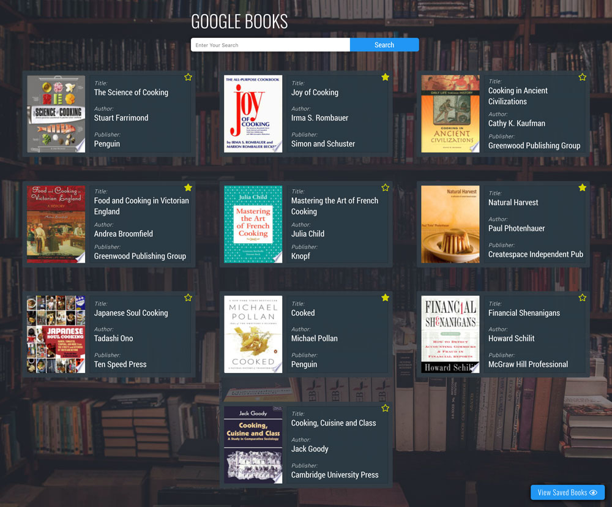
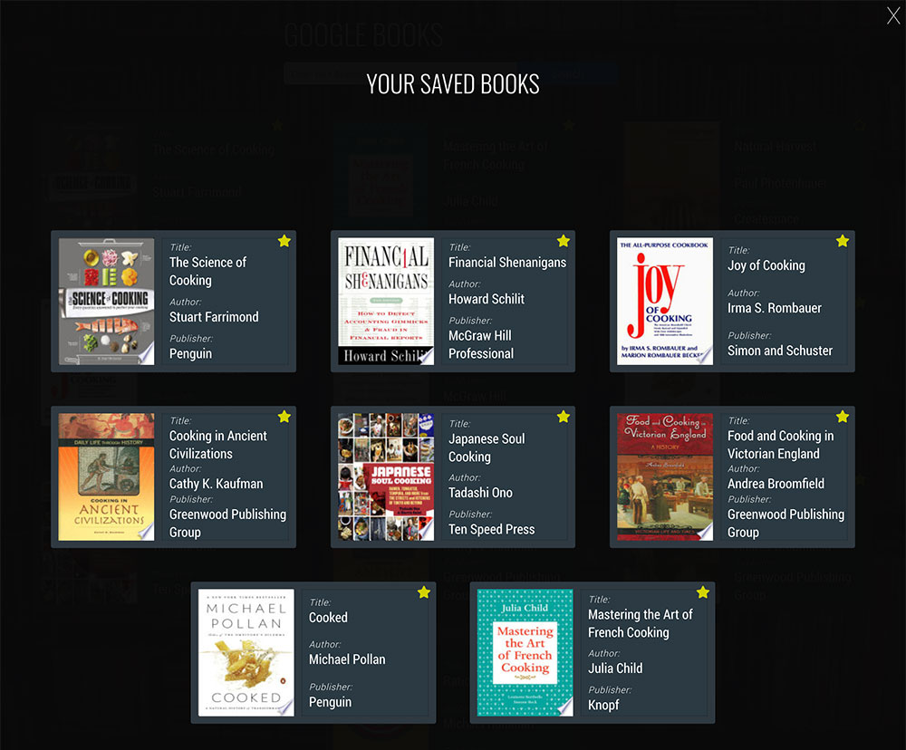

# Google Books

## Overview:

Google Book is a take home challenge from 8th Light. This web app allows you to search for books from googles api and then save and view all of them together. The requirements for this project were:

- Type in a query and display a list of 5 books matching that query.
- Each item in the list should include the book's author, title, and publishing company.
- A user should be able to select a book from the five displayed to save to a “Reading List”
- View a “Reading List” with all the books the user has selected from their queries -- this is a local reading list and not tied to Google Books’s account features.

## Preview:

Home Page Search           |  View Saved Books
:-------------------------:|:-------------------------:
  |  

## Getting Started:

These instructions will get a copy of the project up and running on your local machine for usage and testing purposes.

### Frontend
clone down the repo: ```$ git clone https://github.com/MRKrog/GoogleBook```

cd into directory and run npm install: ```$ npm install```

Start up in your terminal: ```$ npm start ```


### Technologies Used
Google Book was built using:
- [React.js](https://reactjs.org/)
- [Redux.js](https://redux.js.org/)
- [SCSS](https://sass-lang.com/)
- [Google Book API](https://developers.google.com/maps/documentation/)

And tested using:
- [Enzyme](https://airbnb.io/enzyme/) & [Jest](https://airbnb.io/enzyme/docs/guides/jest.html)

## Contributors
- [Michael Krog](https://github.com/MRKrog)

---
**[Back to top](https://github.com/MRKrog/googleBooks/blob/master/README.md)**
